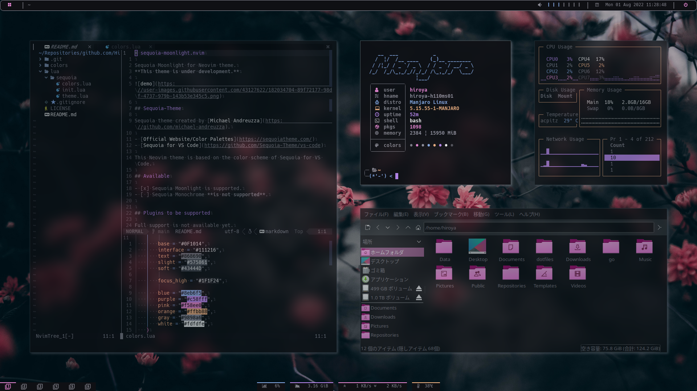
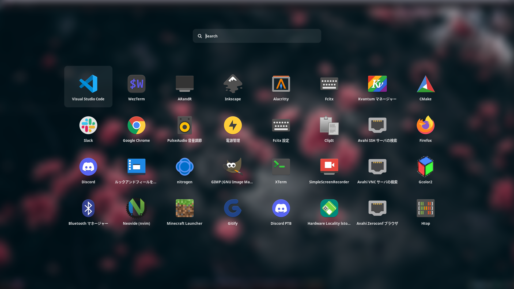

# dotfiles

- Distro: [Manjaro Linux](https://manjaro.org/downloads/community/i3/)
- WM: [i3-gaps](https://github.com/Airblader/i3)
- Compositor: [picom-jonaburg](https://github.com/jonaburg/picom)
- Bar: [polybar](https://github.com/polybar/polybar)
  - Theme: [polybar-sequoia-theme](https://github.com/Hiroya-W/polybar-sequoia-theme)
- Launcher: [rofi](https://github.com/davatorium/rofi)
  - Theme: [rofi](https://github.com/adi1090x/rofi)
- GTK Theme: Customized based on Breeze-Dark
- GTK Icons: [Breeze-Dark - Pink Color Scheme](https://store.kde.org/p/1264277)
- Terminal: Wezterm
  - Theme: Sequoia-Moonlight
  - Terminal Font: [HackGen](https://github.com/yuru7/HackGen)




## Install

Install chezmoi:

```bash
sudo pacman -S chezmoi
```

Install the dotfiles:

```bash
chezmoi init --apply https://github.com/Hiroya-W/dotfiles.git
```

## References

Here is the setup using the Ansible.

[Hiroya-W/hiroya-manjaroi3-playbooks](https://github.com/Hiroya-W/hiroya-manjaroi3-playbooks)
