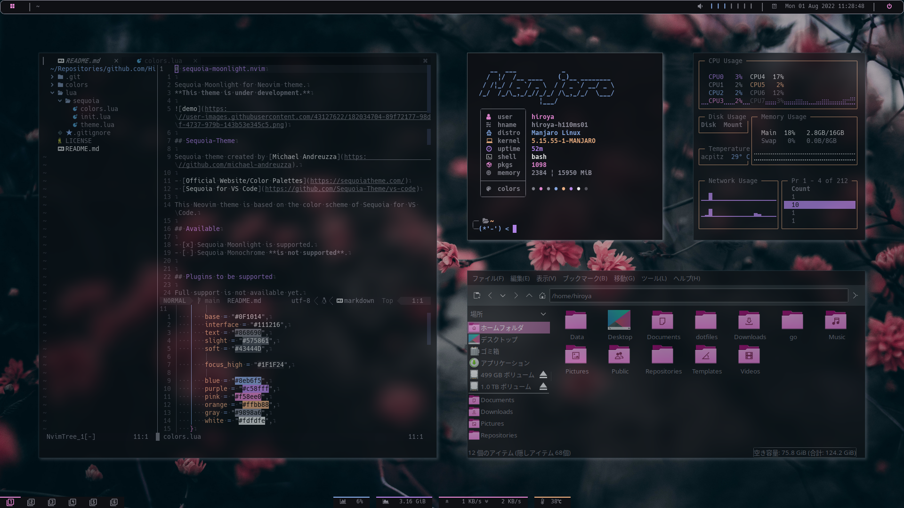

## screenshots

### Sequoia-Moonlight

- Distro: [Manjaro Linux](https://manjaro.org/downloads/community/i3/)
- WM: [i3-gaps](https://github.com/Airblader/i3)
- Compositor: [picom-jonaburg](https://github.com/jonaburg/picom)
- Bar: [polybar](https://github.com/polybar/polybar)
  - Theme: [polybar-sequoia-theme](https://github.com/Hiroya-W/polybar-sequoia-theme)
- Launcher: [rofi](https://github.com/davatorium/rofi)
  - Theme: [rofi](https://github.com/adi1090x/rofi)
- GTK Theme: Breeze-Dark
- GTK Icons: [Breeze-Dark - Pink Color Scheme](https://store.kde.org/p/1264277)
- Terminal: Wezterm
  - Theme: Sequoia-Moonlight
  - Terminal Font: [HackGen](https://github.com/yuru7/HackGen)

### Adapta-Nokto

- Distro: [Manjaro Linux](https://manjaro.org/downloads/community/i3/)
- WM: [i3-gaps](https://github.com/Airblader/i3)
- Compositor: [picom-ibhagwan](https://github.com/ibhagwan/picom)
- Bar: [polybar](https://github.com/polybar/polybar)
  - Theme: [Polybar-Adapta-theme](https://github.com/matoruru/polybar-adapta-theme)
- Launcher: [rofi](https://github.com/davatorium/rofi)
  - Theme: [rofi](https://github.com/adi1090x/rofi)
- GTK Theme: [Adapta-Nokto-Eta](https://github.com/adapta-project/adapta-gtk-theme)
- GTK Icons: [Papirus-Dark](https://github.com/PapirusDevelopmentTeam/papirus-icon-theme)
- VSCode 
  - Theme: [Tokyo City](https://github.com/huytd/vscode-tokyo-city)
  - Icons: [Material Theme Icons](https://github.com/material-theme/vsc-material-theme)
- Terminal: Alacritty
  - Theme: [Material Theme](https://github.com/eendroroy/alacritty-theme)
  - Terminal Font: [HackGen](https://github.com/yuru7/HackGen)

